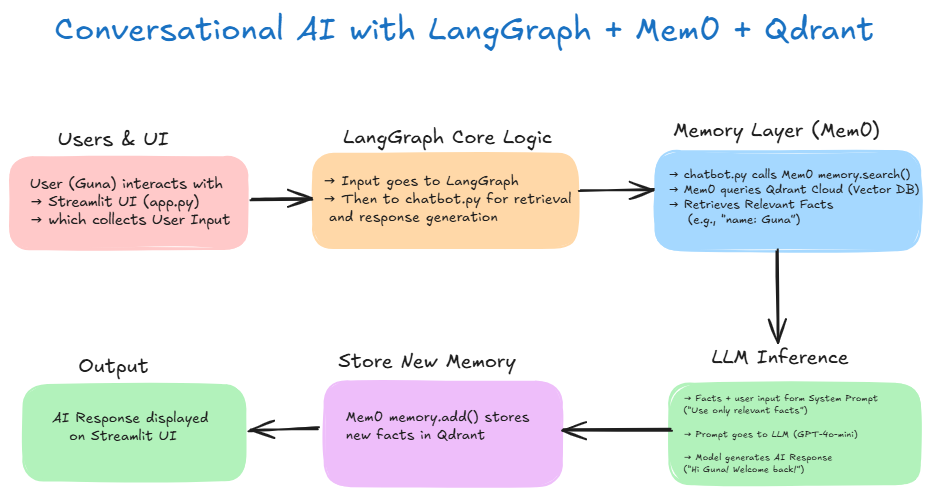
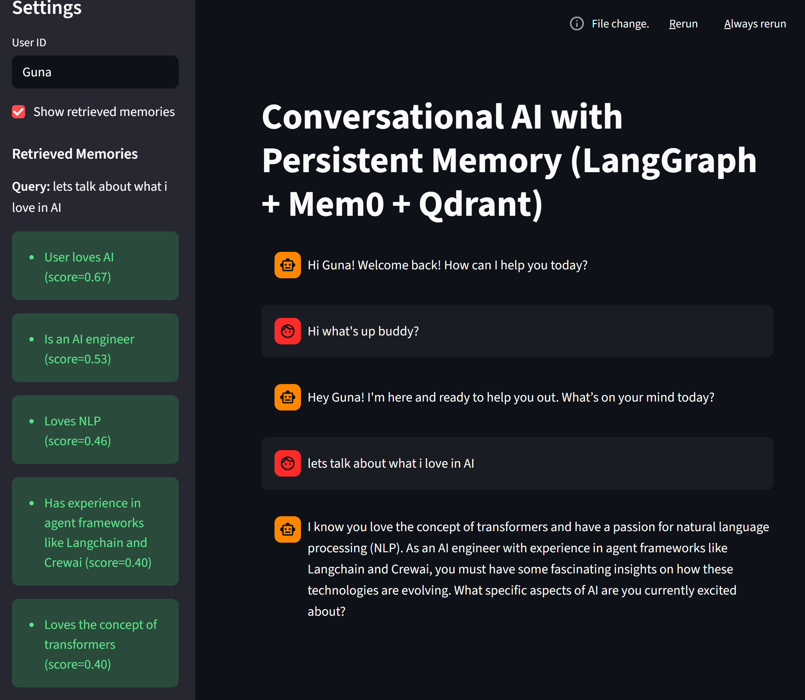

# Mem0-Powered AI Conversational Assistant  
**Never forget your users again.**

A **memory-powered chatbot** that remembers your name, job, hobbies — across sessions, restarts, and devices.

Built with:  
`LangGraph` + `Mem0` + `Qdrant Cloud` + `Streamlit` + `GPT-4o-mini`

---

## Why This Matters

| Without Mem0 | With Mem0 |
|--------------|-----------|
| "Hi, who are you?" every time | "Hi Guna! How’s is your AI journey?" |
| Repeats context | Saves 90% tokens |
| Generic bot | Personal companion |

> **Mem0 = The missing memory layer for AI agents.**

---

## How It Works (Block Diagram)




## 🧩 Installation & Setup (Windows)

> 💡 **Recommended:** Use [`uv`](https://docs.astral.sh/uv/) for isolated virtual environments — it’s faster and more reliable than pip/venv.

### 1️⃣ Clone the Repository
```bash
git clone https://github.com/gunavathi8/Mem0-Powered-AI-Conversational-Assistant.git
cd mem0-convo-ai
```

### 2️⃣ Create a Virtual Environment with uv
```bash
# Install uv (if not already)
pip install uv

# Create a virtual environment
uv init mem0_convo_ai

# Navigate into the Project
cd mem0-convo-ai

#Activate the Virtual Environment
.venv\Scripts\activate
```

### 3️⃣ Add Dependencies
```bash
uv add streamlit langgraph 

# add all the required packages from requirements.txt
```


### 4️⃣ Set Up Environment Variables
Create a .env file in the project root with your keys:
```bash
OPENAI_API_KEY=""
QDRANT_API_KEY=""
QDRANT_URL=
QDRANT_COLLECTION=""
MEM0_EMBEDDING_DIMS = ""
```
### 🚀 Run the Application
```bash
streamlit run app.py
```

### 💾 How It Works (Step-by-Step)

1️⃣ User Interaction (Streamlit)

The UI collects input and sends it to the LangGraph workflow.

2️⃣ LangGraph Workflow

Handles stateful flow — connects nodes for chatbot logic.

3️⃣ Mem0 Memory Layer

Extracts key facts (like name, city, job)

Stores them in Qdrant Cloud (Vector DB)

Retrieves only relevant context next time.

4️⃣ LLM Inference (GPT-4o-mini)

Combines current input + retrieved memory

Generates a personalized response.

5️⃣ Logging

All new memories are stored in mem0_memories.json for transparency and tracking.

### 🔗 Tech Stack
| Component        | Purpose                                  |
| ---------------- | ---------------------------------------- |
| **LangGraph**    | Workflow and state management            |
| **Mem0**         | Memory layer (fact extraction + storage) |
| **Qdrant Cloud** | Vector database for long-term memory     |
| **GPT-4o-mini**  | LLM for contextual responses             |
| **Streamlit**    | Web-based UI for demo                    |
| **uv**           | Fast dependency & environment manager    |


---

## 🧠 Example Usage

Once the app is running, open it in your browser (usually at [http://localhost:8501](http://localhost:8501)).

Here’s a quick demo of how Mem0’s long-term memory works in action 👇

---

### 💬 Conversation Example

**User:**  
> Hi, what's up buddy?

**AI:**  
> Hey Guna! I'm here and ready to help you out. What’s on your mind today?

---

**User:**  
> Let's talk about what I love in AI.

**AI:**  
> I know you love the concept of transformers and have a passion for natural language processing (NLP).  
> As an AI engineer with experience in agent frameworks like LangChain and CrewAI,  
> you must have some fascinating insights on how these technologies are evolving.  
> What specific aspects of AI are you currently excited about?

---

This demonstrates how the assistant **remembers who you are** — even across sessions.  
Mem0 fetches stored memories from Qdrant, merges them into the system prompt,  
and the LLM responds as if it truly *knows* you.

---

### 🖼️ Screenshot Preview



*(Image above shows the Streamlit chat interface with persistent memory responses.)*

---

> “Every fact you share gets saved permanently.  
> Next session? It’s already there.”  

That’s the **magic of Mem0**.


### 🧷 License
MIT © Gunavathi